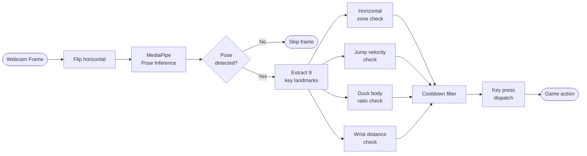
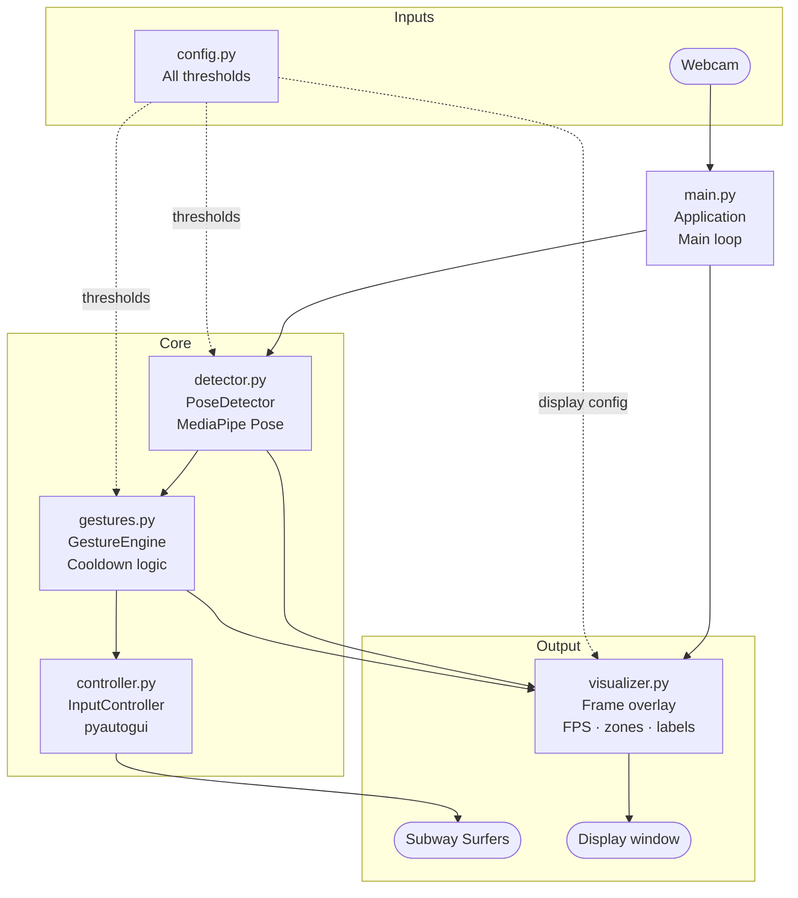

# Subway Surfers Motion Controller

A real-time motion-controlled interface for Subway Surfers that uses your webcam and body pose to replace keyboard input. Built with MediaPipe Pose, OpenCV, and PyAutoGUI.

https://github.com/punyamodi/Subway-Surfers-Motion-Controlled/assets/68418104/84a75635-af0d-4cb7-b561-1794155760e4

---

## Features

- Real-time human pose estimation via MediaPipe Pose
- Five distinct gesture controls mapped to game actions
- Body-ratio-based duck detection that adapts to your distance from the camera
- Velocity-based jump detection with movement smoothing
- Three-zone horizontal lane tracking with visual indicators
- Fade-out gesture feedback rendered on the webcam overlay
- Smooth FPS counter with rolling average
- Three-second countdown before input begins
- Clean shutdown on pressing Q
- All thresholds configurable from a single `config.py` file

---

## How It Works

Each camera frame travels through a fixed pipeline before any key is pressed.



The shoulder midpoint determines which of the three horizontal zones the player occupies. A zone transition fires a left or right arrow key. Jump is detected from the upward velocity of the shoulder midpoint sampled every 50 ms. Duck fires when the nose-to-hip Euclidean distance divided by torso length drops below a configurable ratio. Roll fires when both wrists are within a pixel threshold of each other. Every gesture has an independent cooldown timer so accidental rapid repeats are suppressed.

---

## Gesture Reference

| Gesture | Body Movement | Game Action |
|---|---|---|
| Move Right | Lean your shoulders into the right zone | Shift one lane right |
| Move Left | Lean your shoulders into the left zone | Shift one lane left |
| Jump | Quickly raise your body upward | Jump |
| Slide | Crouch or bend forward toward the camera | Slide under obstacle |
| Roll | Bring both wrists close together | Activate power-up or roll |

The frame is divided into three vertical zones. The left boundary is at 10/27 of the frame width and the right boundary is at 17/27. When your shoulder midpoint crosses a boundary, the corresponding key is sent to the active window.

---

## Requirements

- Python 3.9 or later
- A webcam
- Subway Surfers running in any browser (focus the browser window before starting)

---

## Installation

```bash
git clone https://github.com/punyamodi/Subway-Surfers-Motion-Controlled.git
cd Subway-Surfers-Motion-Controlled
pip install -r requirements.txt
```

---

## Usage

1. Open Subway Surfers in your browser and click into the game window.
2. In a separate terminal, run:

```bash
python main.py
```

3. A three-second countdown will appear in the webcam window.
4. Stand roughly one to two metres from the camera so your upper body is visible.
5. Use the gestures in the table above to control the game.
6. Press **Q** in the webcam window to quit.

---

## Project Structure



```
Subway-Surfers-Motion-Controlled/
├── main.py          Application entry point and main loop
├── config.py        All tunable parameters in one place
├── detector.py      MediaPipe Pose wrapper and PoseLandmarks dataclass
├── gestures.py      Stateful gesture engine with per-gesture cooldowns
├── controller.py    Key press dispatcher (pyautogui)
├── visualizer.py    Webcam overlay rendering
└── requirements.txt
```

---

## Configuration

All parameters live in `config.py` as a `Config` dataclass. Key fields:

| Field | Default | Description |
|---|---|---|
| `frame_width` | 1280 | Webcam capture width |
| `frame_height` | 720 | Webcam capture height |
| `left_zone_ratio` | 10/27 | Left lane boundary as fraction of frame width |
| `right_zone_ratio` | 17/27 | Right lane boundary as fraction of frame width |
| `jump_shoulder_threshold` | 22.0 | Minimum upward pixel movement to trigger jump |
| `duck_body_ratio` | 1.3 | Nose-to-hip divided by torso-length ratio below which duck fires |
| `hands_joined_threshold` | 100 | Max wrist-to-wrist pixel distance for roll gesture |
| `jump_cooldown` | 0.4 s | Minimum time between consecutive jumps |
| `duck_cooldown` | 0.5 s | Minimum time between consecutive ducks |
| `roll_cooldown` | 0.6 s | Minimum time between consecutive rolls |
| `model_complexity` | 1 | MediaPipe model complexity (0 = fastest, 2 = most accurate) |

Reduce `model_complexity` to `0` on slower hardware to improve frame rate.

---

## Tips

- Ensure the room is well lit so pose detection is stable.
- Position yourself so your head, shoulders, and hips are all visible in the frame.
- The grey zone labels at the bottom of the window show which lane is currently active.
- Detected gestures appear in the top-left corner and fade out after half a second.

---

## License

MIT License.
